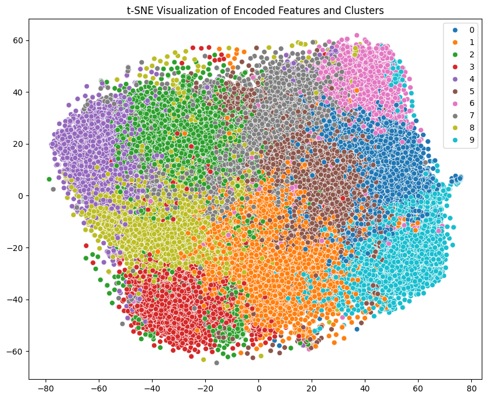
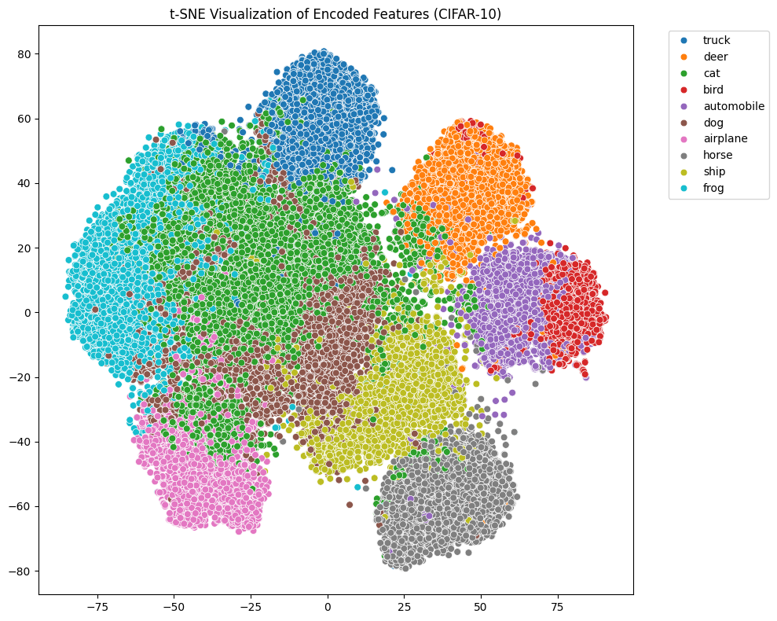
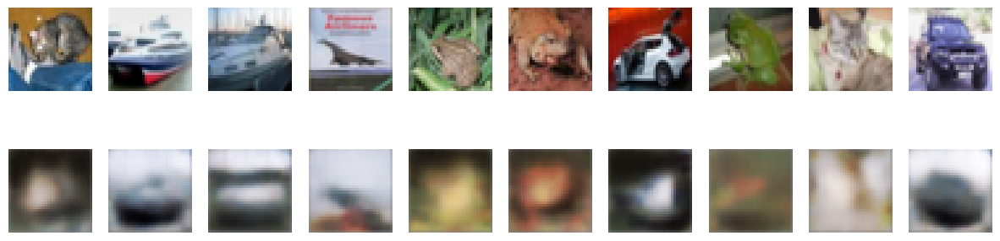
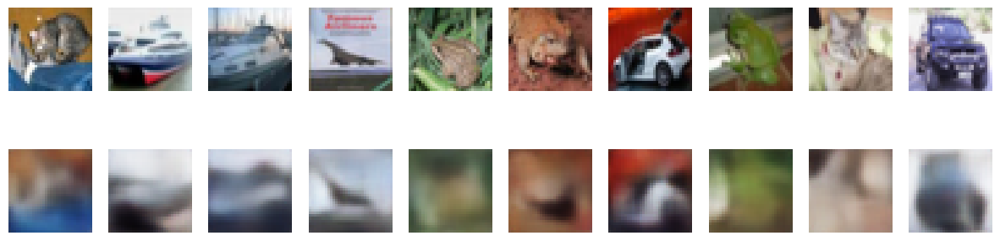

# CIFAR-10 Unsupervised clustering
## https://www.cs.toronto.edu/~kriz/cifar-10-python.tar.gz

## 21/03/2025

made start

## 22/03/2025

experimented with different encoder and decoder structures
added a classifier head on top of the encoder for multitask learning

## 23/03/2025 

change latent size 512 to 1024 for better details retention 
replaced UpSampling2D with Conv2DTranspose as it was too blocky
Added BatchNormalization() for better convergence.

switched to tanh rather the sigmoid and has improved preformance

decoded images are coming out more blurry but less blocky

before 

after

