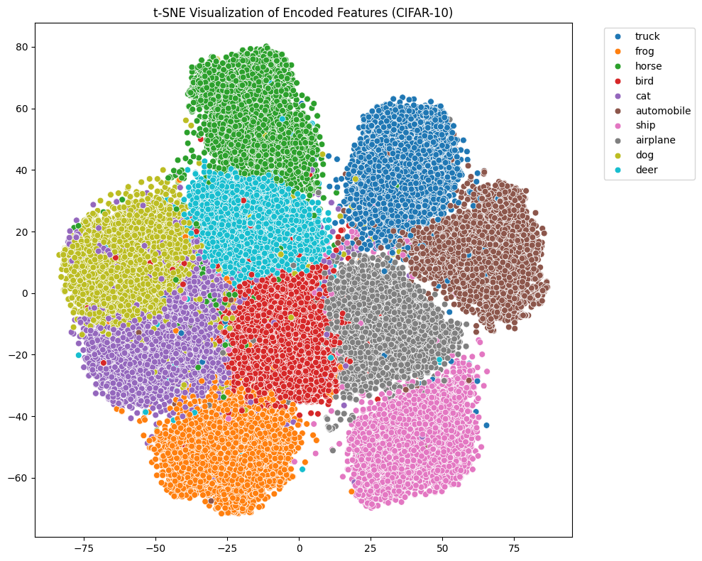

# CIFAR-10 Unsupervised clustering

## Dataset
https://www.cs.toronto.edu/~kriz/cifar-10-python.tar.gz

## 21/03/2025
Made start

## 22/03/2025
- Experimented with different encoder and decoder structures
- Added a classifier head on top of the encoder for multitask learning

## 23/03/2025 
- Changed latent size 512 to 1024 for better details retention 
- Replaced UpSampling2D with Conv2DTranspose as it was too blocky
- Added BatchNormalization() for better convergence
- Switched to tanh rather than sigmoid and has improved performance

Current results:

Decoded images are coming out more blurry but less blocky

Before:

After:

## 24/03/2025
With ChatGPT:
- Replaced TensorFlow implementation with PyTorch to resolve GPU compatibility issues and improve training stability
- Converted two deep learning models from `tf.keras` to `torch.nn.Module`, retaining original architectures and training logic

began markdown
